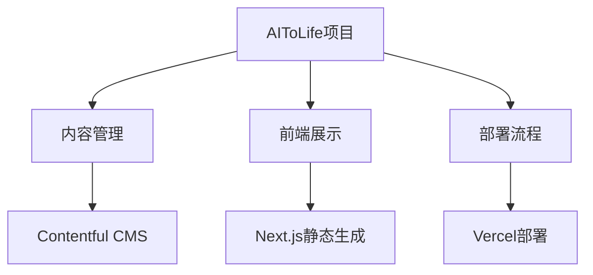
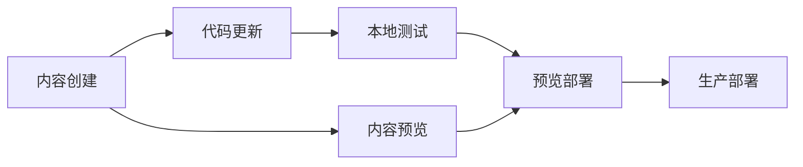

# Contentful集成项目计划

## 1. 项目概述



### 1.1 项目目标
- 从模拟数据迁移到Contentful CMS
- 实现内容的结构化管理和多语言支持
- 保持高性能的静态站点生成
- 简化内容更新流程

### 1.2 技术选择
- **内容管理系统**: Contentful
- **前端框架**: Next.js
- **样式系统**: Tailwind CSS
- **部署平台**: Vercel
- **国际化**: 客户端i18n实现

## 2. Contentful设置指南

### 2.1 账户和空间设置
1. 创建Contentful账户（如果尚未创建）
2. 创建新的空间（Space）
3. 获取API密钥：
   - Space ID
   - Content Delivery API访问令牌
   - Content Preview API访问令牌

### 2.2 内容模型设置

根据doc/contentful-models.md文件，需要创建以下内容类型：

#### 工具 (Tool)
| 字段名 | 字段 ID | 类型 | 描述 |
|--------|---------|------|------|
| 标题 | title | Short text | 工具名称 |
| 链接标识 | slug | Short text | URL 友好的唯一标识符 |
| 描述 | description | Short text | 简短描述，用于工具卡片和列表 |
| 内容 | content | Rich text | 详细介绍，支持富文本格式 |
| 图片 | image | Media | 工具图片或logo |
| 评分 | rating | Number (decimal) | 工具评分，1-5分 |
| 价格类型 | pricingType | Short text (enum) | 价格类型：免费(free)、免费增值(freemium)、付费(paid)、订阅制(subscription) |
| 外部链接 | externalUrl | Short text | 工具官方网站链接 |
| 分类 | categories | Reference, many | 关联到多个分类 |
| 优点 | pros | Short text, list | 工具的优点列表 |
| 缺点 | cons | Short text, list | 工具的缺点列表 |
| 替代工具 | alternatives | Short text, list | 替代工具列表 |
| 创建日期 | createdAt | Date | 工具创建日期，用于排序 |
| 更新日期 | updatedAt | Date | 最后更新日期 |
| 标签 | tags | Short text, list | 相关标签 |

#### 分类 (Category)
| 字段名 | 字段 ID | 类型 | 描述 |
|--------|---------|------|------|
| 标题 | title | Short text | 分类名称 |
| 链接标识 | slug | Short text | URL 友好的唯一标识符 |
| 描述 | description | Short text | 分类描述 |
| 图标 | icon | Short text | 用于表示分类的图标名称 |

#### 博客文章 (Blog Post)
| 字段名 | 字段 ID | 类型 | 描述 |
|--------|---------|------|------|
| 标题 | title | Short text | 文章标题 |
| 链接标识 | slug | Short text | URL 友好的唯一标识符 |
| 摘要 | excerpt | Short text | 文章简短摘要 |
| 内容 | content | Rich text | 文章正文内容 |
| 封面图 | coverImage | Media | 文章封面图片 |
| 发布日期 | date | Date | 文章发布日期 |
| 作者 | author | Reference | 关联到作者 |
| 分类 | category | Reference | 关联到文章分类 |
| 标签 | tags | Short text, list | 文章标签 |

#### 应用领域 (Application)
| 字段名 | 字段 ID | 类型 | 描述 |
|--------|---------|------|------|
| 标题 | title | Short text | 应用领域名称 |
| 链接标识 | slug | Short text | URL 友好的唯一标识符 |
| 描述 | description | Short text | 简短描述 |
| 内容 | content | Rich text | 详细介绍 |
| 图片 | image | Media | 展示图片 |
| 相关工具 | relatedTools | Reference, many | 关联的工具列表 |
| 使用场景 | useCases | Rich text | 具体使用场景示例 |
| 入门指南 | gettingStarted | Rich text | 如何在该领域开始使用 AI 的指南 |

### 2.3 本地化设置
1. 在Contentful空间设置中添加中文(zh-CN)和英文(en-US)两种语言
2. 为以下字段启用本地化：
   - 标题 (title)
   - 描述 (description)
   - 内容 (content)
   - 摘要 (excerpt)
   - 优点 (pros)
   - 缺点 (cons)

## 3. 开发工作流程



### 3.1 环境设置
1. 创建`.env.local`文件，添加Contentful配置：
```
CONTENTFUL_SPACE_ID=your_space_id
CONTENTFUL_ACCESS_TOKEN=your_access_token
CONTENTFUL_PREVIEW_TOKEN=your_preview_token
CONTENTFUL_PREVIEW_SECRET=your_preview_secret
CONTENTFUL_ENVIRONMENT=master
NEXT_PUBLIC_SITE_URL=http://localhost:3000
```

2. 在Vercel中配置相同的环境变量

### 3.2 代码更新流程
1. 创建新的Git分支用于Contentful集成
2. 更新页面组件，从Contentful获取数据
3. 本地测试所有功能
4. 提交代码并创建Pull Request
5. 在预览环境中测试
6. 合并到主分支并部署到生产环境

## 4. 代码更新指南

### 4.1 首页更新 (src/pages/index.tsx)

```typescript
export const getStaticProps: GetStaticProps = async () => {
  try {
    // 从Contentful获取数据
    const posts = {
      zh: await getAllPosts(false),
      en: await getAllPosts(false)
    };
    
    const tools = {
      zh: await getAllTools(false),
      en: await getAllTools(false)
    };
    
    const applications = {
      zh: await getAllApplications(false),
      en: await getAllApplications(false)
    };

    return {
      props: {
        posts,
        tools,
        applications,
      },
      // 如果使用Vercel，可以启用ISR
      revalidate: 3600, // 每小时重新生成一次
    };
  } catch (error) {
    console.error('Error fetching data:', error);

    return {
      props: {
        posts: { zh: [], en: [] },
        tools: { zh: [], en: [] },
        applications: { zh: [], en: [] },
      },
      revalidate: 60, // 出错时，1分钟后重试
    };
  }
};
```

### 4.2 工具详情页更新 (src/pages/tools/[slug].tsx)

```typescript
export const getStaticPaths: GetStaticPaths = async () => {
  try {
    // 从Contentful获取所有工具
    const tools = await getAllTools(false);
    
    // 生成路径
    const paths = tools.map((tool) => ({
      params: { slug: tool.slug },
    }));
    
    return {
      paths,
      fallback: true, // 使用增量静态生成
    };
  } catch (error) {
    console.error('Error generating tool paths:', error);
    return {
      paths: [],
      fallback: true,
    };
  }
};

export const getStaticProps: GetStaticProps = async ({ params }) => {
  try {
    if (!params?.slug) {
      return { notFound: true };
    }
    
    const slug = params.slug as string;
    
    // 从Contentful获取工具数据
    const zhTool = await getToolBySlug(slug, false);
    const enTool = await getToolBySlug(slug, false);
    
    // 如果找不到工具，返回404
    if (!zhTool && !enTool) {
      return { notFound: true };
    }
    
    return {
      props: {
        tool: {
          zh: zhTool,
          en: enTool,
        },
      },
      revalidate: 3600, // 每小时重新生成一次
    };
  } catch (error) {
    console.error(`Error fetching tool with slug ${params?.slug}:`, error);
    return { notFound: true };
  }
};
```

### 4.3 工具列表页更新 (src/pages/tools/index.tsx)

```typescript
export const getStaticProps: GetStaticProps = async () => {
  try {
    // 从Contentful获取工具和分类
    const zhTools = await getAllTools(false);
    const enTools = await getAllTools(false);
    const categories = await getAllCategories(false);
    
    // 将分类转换为前端需要的格式
    const zhCategories = categories.map(cat => ({
      id: cat.sys.id,
      title: cat.title,
      slug: cat.slug,
    }));
    
    const enCategories = categories.map(cat => ({
      id: cat.sys.id,
      title: cat.title,
      slug: cat.slug,
    }));
    
    return {
      props: {
        tools: {
          zh: zhTools,
          en: enTools,
        },
        categories: {
          zh: zhCategories,
          en: enCategories,
        },
      },
      revalidate: 3600, // 每小时重新生成一次
    };
  } catch (error) {
    console.error('Error fetching tools and categories:', error);
    return {
      props: {
        tools: { zh: [], en: [] },
        categories: { zh: [], en: [] },
      },
      revalidate: 60, // 出错时，1分钟后重试
    };
  }
};
```

## 5. 测试和部署规则

### 5.1 测试清单
- [ ] 所有页面能够正确加载
- [ ] 内容正确显示，包括标题、描述、图片等
- [ ] 多语言切换功能正常工作
- [ ] 工具筛选和排序功能正常
- [ ] 链接和导航正常工作
- [ ] 响应式设计在不同设备上正常显示
- [ ] 错误处理机制正常工作

### 5.2 部署流程
1. 确保所有测试通过
2. 提交代码到主分支
3. Vercel自动构建和部署
4. 验证生产环境

### 5.3 内容更新流程
1. 在Contentful中创建或更新内容
2. 发布内容
3. 如果启用了ISR，网站将在设定的时间后自动更新
4. 如果需要立即更新，可以触发手动重新构建

## 6. 性能优化建议

### 6.1 图片优化
- 使用Contentful的图片转换API调整图片大小和格式
- 实现懒加载
- 使用适当的图片格式（WebP优先）

### 6.2 代码优化
- 实现代码分割
- 优化字体加载
- 减少不必要的JavaScript

### 6.3 缓存策略
- 设置适当的缓存头
- 利用Vercel的边缘缓存
- 使用增量静态再生成(ISR)保持内容新鲜